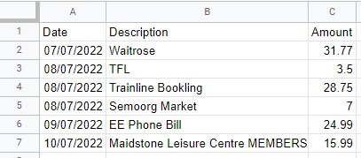
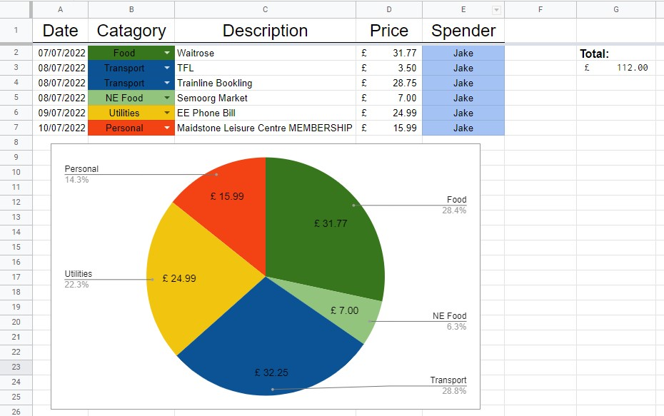

# Finance Tracker

Finance tracker is a python script, who's goal is to automate the amalgamation of transaction data from different sources. The script takes csv files from banks or credit companies, formats transactions into a universal TypedDictionary, then exports the data to Google Sheets where data visualisation is much easier.
#

  

  

  

## TODO
* If a sheet for a month already exists, don't overwrite the data, instead append new data then sort.
* When a new sheet is added for a month, update the **Overview** page to reflect the addition.
* Create and update a [Sankey chart](https://developers.google.com/chart/interactive/docs/gallery/sankey) on the **Overview** page.
* Make the year in sheet titles dynamic from transaction data.
